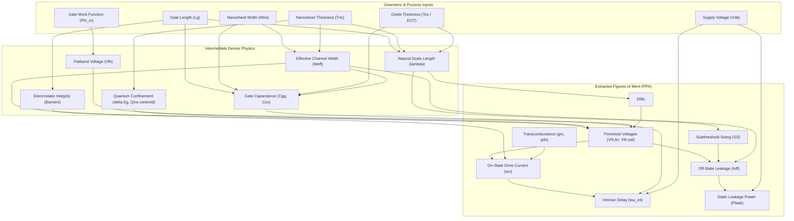

# Comprehensive Technical Guide: Parameter Relationships & Physical Governing Principles in 3-Stack GAAFETs

---

## 1. Executive Summary & Architectural Overview

In a sub-3nm Gate-All-Around Nanosheet Field-Effect Transistor (GAAFET), often termed Multi-Bridge Channel FET (MBCFET), traditional planar and trigate (FinFET) scaling limits are overcome by wrapping a high-k metal gate (HKMG) stack completely around vertically stacked silicon nanosheet channels. 

Understanding the operation of this device requires analyzing how microscopic geometric and material choices dictate electrostatics, quantum mechanical subband occupation, transport kinetics, and macroscopic digital/analog Figures of Merit (PPA).

Every metric in the 18-column TCAD simulation dataset is physically coupled through electrostatic boundary value problems, carrier statistics, and short-channel effects (SCE).



---

## 2. Fundamental Physics & Governing Formulations

### 2.1 Electrostatic Integrity & The Natural Scale Length ($\lambda$)

The degree to which the gate maintains control over the channel potential versus the drain terminal is governed by the 3D Poisson equation. For a Gate-All-Around geometry with rectangular cross-section ($W_{ns} \times T_{ns}$), the characteristic electrostatic decay length (natural scale length $\lambda$) is given analytically by:

$$\lambda = \sqrt{\frac{\epsilon_{si}}{2\epsilon_{ox}} \cdot T_{ns} \cdot T_{ox} \cdot \left(1 + \frac{T_{ns}}{2 W_{ns}}\right)}$$

Where:
- $\epsilon_{si}$ is the permittivity of silicon ($\approx 11.7 \times \epsilon_0$)
- $\epsilon_{ox}$ is the effective permittivity of the gate dielectric stack ($\text{SiO}_2$ IL + $\text{HfO}_2$, effective $\kappa \approx 22$)
- $T_{ns}$ is nanosheet physical thickness (nominally $4\text{ nm}$)
- $T_{ox}$ is dielectric physical thickness (interfacial layer + high-k)
- $W_{ns}$ is nanosheet physical width (nominally $15\text{ to } 30\text{ nm}$)

**Physical Criterion for Short-Channel Immunity:**
To suppress short-channel effects (SCE), the physical gate length must satisfy:
$$L_g \ge 3\lambda \quad \text{to} \quad 4\lambda$$

- When $L_g \gg 3\lambda$, the central channel potential is determined exclusively by the gate voltage $V_{GS}$.
- When $L_g < 3\lambda$, the depletion fields from the drain penetrate into the channel core, weakening the barrier and causing threshold voltage roll-off, subthreshold degradation, and severe DIBL.

---

### 2.2 Quantum Mechanical Confinement in Nanosheets

When the physical silicon thickness $T_{ns} \le 5\text{ nm}$, carriers are confined in a 1D/2D potential well. In Sentaurus TCAD, this is modeled via the **eQuantumPotential (Density-Gradient)** equation:

$$\Lambda = -\frac{\hbar^2}{12 m^*} \nabla^2 \ln(n)$$

This produces two critical physical consequences:

1. **Inversion Centroid Displacement:**
   Classically, electron density peaks immediately at the $\text{Si}/\text{HfO}_2$ oxide interface. Under quantum mechanical confinement, wave function vanishing boundary conditions force the electron density to peak near the **geometric center** of the nanosheet ($z = T_{ns} / 2$).
   - *Advantage:* Carriers are kept away from interface traps and surface roughness, improving carrier mobility ($\mu_{eff}$).
   - *Trade-off:* An effective quantum capacitance in series with the oxide capacitance is created ($1/C_{gate} = 1/C_{ox} + 1/C_{quant} + 1/C_{inv}$), slightly reducing gate control.

2. **Effective Bandgap Broadening:**
   Due to quantum size quantization, the ground-state subband energy $E_1$ shifts above the bulk conduction band edge:
   $$\Delta E_C \approx \frac{\pi^2 \hbar^2}{2 m_z^* T_{ns}^2}$$
   As $T_{ns}$ scales down from $8\text{ nm}$ to $4\text{ nm}$, the effective bandgap widens by $\approx 80\text{--}150\text{ meV}$, which shifts $V_{th}$ positively.

---

### 2.3 Flatband Voltage ($V_{FB}$) and Work Function Physics

The flatband voltage represents the gate bias required to achieve zero net band bending in the silicon channel:

$$V_{FB} = \Phi_m - \Phi_s = \Phi_m - \left(\chi_{si} + \frac{E_g}{2q} + \phi_B\right)$$

Where:
- $\Phi_m$ is the effective gate metal work function (calibrated to $4.384\text{ eV}$).
- $\Phi_s$ is the silicon substrate/channel work function.
- $\chi_{si} \approx 4.05\text{ eV}$ is the electron affinity of silicon.
- For an undoped or lightly doped nanosheet channel ($\approx 10^{15}\text{ cm}^{-3}$), the Fermi level is near midgap, so $\Phi_s \approx 4.61\text{ eV}$.

Because the nanosheets are **fully depleted** (volume of silicon is so thin that no depletion charge exists to support a bulk space-charge layer), the classic bulk depletion term $Q_{dep} / C_{ox} \to 0$. Consequently:

$$V_{th} \approx V_{FB} + 2\phi_B + \Delta V_{quant}$$

$$\frac{\partial V_{th}}{\partial \Phi_m} \approx +1.00 \quad [\text{V/eV}]$$

**Why Work Function Calibration was Essential:**
At the Sentaurus TCAD built-in default for generic 3D metal ($\Phi_m = 4.250\text{ eV}$):
$$V_{FB} = 4.250 - 4.61 = -0.36\text{ V} \implies V_{th} \approx 0.116\text{ V}$$
By setting $\Phi_m = 4.384\text{ eV}$ in `gate.par`, $\Delta \Phi_m = +0.134\text{ eV}$, causing an exact $+0.134\text{ V}$ upward shift:
$$V_{th} = 0.116\text{ V} + 0.134\text{ V} = \mathbf{0.250\text{ V}}$$

---

## 3. Systematic Breakdown of Extracted Figures of Merit (18 Columns)

### Column 5: Effective Channel Width (`Weff_um`)

In a multi-stack GAAFET, gate dielectric and metal encompass all four sides of each rectangular nanosheet sheet. For $N_{sheet} = 3$ stacked sheets:

$$W_{eff} = N_{sheet} \times 2 \times (W_{ns} + T_{ns})$$

*Example for nominal geometry ($W_{ns} = 15\text{ nm}, T_{ns} = 4\text{ nm}$):*
$$W_{eff} = 3 \times 2 \times (0.015\ \mu\text{m} + 0.004\ \mu\text{m}) = 6 \times 0.019\ \mu\text{m} = \mathbf{0.114\ \mu\text{m}}$$

*Interdependence:*
- All currents ($I_{on}, I_{off}$), transconductance ($g_m$), and capacitances ($C_{gg}$) are normalized by $W_{eff}$ to provide width-independent intrinsic technological metrics ($\text{mA}/\mu\text{m}, \text{pA}/\mu\text{m}, \text{fF}/\mu\text{m}$).

---

### Column 6 & 7: Linear and Saturation Threshold Voltages (`Vth_lin_V`, `Vth_sat_V`)

1. **Linear Threshold Voltage ($V_{th,lin}$)**:
   Extracted at low lateral field ($V_{DS} = 0.10\text{ V}$) via the **Maximum Transconductance ($g_m$) Tangent Extrapolation Method**:
   $$V_{th,lin} = V_{GS}\Big|_{g_{m,max}} - \frac{I_D\big|_{g_{m,max}}}{g_{m,max}} - \frac{V_{DS}}{2}$$
   This removes source/drain series resistance distortion and isolates the gate voltage where strong inversion begins.

2. **Saturation Threshold Voltage ($V_{th,sat}$)**:
   Extracted at high operational field ($V_{DS} = V_{DD} = 0.70\text{ V}$) via the **Constant Current Method**:
   $$I_{th} = 100\text{ nA} \times \left(\frac{W_{eff}}{L_g}\right)$$
   $$V_{th,sat} = V_{GS}\Big|_{I_D = I_{th}}$$
   This captures the effective threshold seen by digital logic circuits under full supply bias.

---

### Column 8: Subthreshold Swing (`SS_mVdec`)

The Subthreshold Swing ($SS$) quantifies how sharply the transistor turns off. It is defined as the gate voltage increment required to change the drain current by one order of magnitude (one decade):

$$SS = \left( \frac{\partial \log_{10} I_D}{\partial V_{GS}} \right)^{-1} = \ln(10) \cdot \frac{k_B T}{q} \cdot \left(1 + \frac{C_{dep} + C_{it}}{C_{ox}}\right)$$

At $T = 300\text{ K}$:
$$\ln(10) \cdot \frac{k_B T}{q} \approx 59.6\text{ mV/dec} \quad (\text{Theoretical Thermal Limit})$$

- In planar bulk MOSFETs, $C_{dep}$ is large, giving $SS \approx 80\text{--}100\text{ mV/dec}$.
- In FinFETs, $SS \approx 68\text{--}75\text{ mV/dec}$.
- In our 3-Stack GAAFET, because the nanosheet is surrounded on all four sides and fully depleted ($C_{dep} \approx 0$), the body factor $n = 1 + C_{dep}/C_{ox} \to 1.00$.
- Result in our calibrated dataset: **$SS = 60.1\text{ to } 62.5\text{ mV/dec}$**, extremely close to the absolute physical limit of nature!

---

### Column 9: Drain-Induced Barrier Lowering (`DIBL_mV_V`)

In long-channel devices, the channel barrier height is controlled solely by $V_{GS}$. In short-channel devices, applying a positive drain bias $V_{DS}$ lowers the source-channel electrostatic barrier, causing threshold voltage reduction:

$$DIBL = \frac{V_{th,lin} - V_{th,sat}}{V_{DD} - V_{DS,lin}} \times 1000 \quad \left[\frac{\text{mV}}{\text{V}}\right]$$

*Technical Meaning:*
- If $DIBL = 25\text{ mV/V}$, increasing $V_{DS}$ by $1.0\text{ V}$ lowers the threshold voltage by $25\text{ mV}$.
- Lower DIBL indicates superior gate electrostatic control. The IRDS 2024 target for the 2nm/sub-2nm node is $DIBL < 45\text{ mV/V}$. Our nominal GAAFET exhibits **$25.3\text{ mV/V}$**, demonstrating outstanding electrostatic gate shielding.

---

### Column 10: On-State Drive Current (`Ion_mA_um`)

Measured at full operational bias: $V_{GS} = V_{DS} = V_{DD} = 0.70\text{ V}$.

$$I_{on} = W_{eff} \cdot Q_{inv}(V_{DD}) \cdot v_{inj}$$

Where:
- $Q_{inv} \approx C_{ox} (V_{DD} - V_{th})$ is the inversion charge density per unit area.
- $v_{inj}$ is the source injection velocity (governed by ballistic transport and high-field saturation velocity $v_{sat} \approx 1.0 \times 10^7\text{ cm/s}$).

*Coupling Mechanism:*
- Decreasing $V_{th}$ increases gate overdrive $(V_{DD} - V_{th})$, boosting $I_{on}$.
- Decreasing $L_g$ increases lateral electric field ($E_x \approx V_{DD} / L_g$), pushing carriers deeper into velocity saturation and ballistic overshoot.

---

### Column 11 & 12: Off-State Leakage Current (`Ioff_pA_um`, `logIoff`)

Evaluated at zero gate voltage and full drain supply: $V_{GS} = 0.00\text{ V}, V_{DS} = V_{DD} = 0.70\text{ V}$.

Mathematically, $I_{off}$ is tied directly to $V_{th,sat}$ and Subthreshold Swing $SS$:

$$I_{off} = I_{th} \times 10^{-\frac{V_{th,sat}}{SS / 1000}}$$

$$\log_{10}(I_{off}) \approx \log_{10}(I_{th}) - \frac{V_{th,sat}}{SS / 1000}$$

**The Exponential Leakage Law:**
- Because $SS \approx 62\text{ mV/dec}$, every **$62\text{ mV}$ increase in $V_{th}$ reduces $I_{off}$ by exactly a factor of 10 (1 decade)**!
- In our uncalibrated baseline ($V_{th} \approx 0.116\text{ V}$), the threshold was too low by $\Delta V_{th} = 0.134\text{ V} \approx 2.2 \times SS$.
- Hence, $I_{off}$ was elevated by $10^{2.2} \approx 150\times$!
- Calibrating $V_{th}$ to $0.250\text{ V}$ lowered $I_{off}$ from $230,000\text{ pA}/\mu\text{m}$ to **$1,742\text{ pA}/\mu\text{m}$**, saving massive amounts of standby battery power.

---

### Column 13 & 14: Transconductance (`gm_max_mS_um`) & Output Conductance (`gds_mS_um`)

1. **Transconductance ($g_m$)**:
   $$g_m = \frac{\partial I_D}{\partial V_{GS}}\Bigg|_{V_{DS}}$$
   Reflects current amplification capability. Higher $g_m$ yields faster voltage transitions across capacitive loads.

2. **Output Conductance ($g_{ds}$)**:
   $$g_{ds} = \frac{\partial I_D}{\partial V_{DS}}\Bigg|_{V_{GS}}$$
   Reflects how flat the saturation curve is. A lower $g_{ds}$ indicates minimal channel length modulation ($\Delta L / L_g$).

3. **Intrinsic Voltage Gain ($A_v$)**:
   $$A_v = \frac{g_m}{g_{ds}}$$
   GAAFETs achieve $A_v > 25\text{--}35\text{ dB}$, outperforming FinFETs because the complete surrounding gate eliminates substrate leakage paths.

---

### Column 15: Gate Capacitance (`Cgg_fF_um`)

The total gate capacitance includes intrinsic oxide capacitance, quantum capacitance, and outer/inner fringe and overlap parasitic capacitances:

$$C_{gg} = C_{ox,eff} \cdot L_g + 2 C_{fringe} + 2 C_{overlap}$$

- Scaled with gate length: Longer $L_g \implies$ Higher $C_{gg}$.
- Scaled with sheet perimeter: Wider $W_{ns}$ or thicker $T_{ns} \implies$ Higher total capacitance.

---

### Column 16: Static Leakage Power Dissipation (`Pleak_pW_um`)

Static power consumption per micron of effective width during inactive standby:

$$P_{leak} = I_{off} \times V_{DD}$$

- Evaluated at $V_{DD} = 0.70\text{ V}$.
- At $I_{off} = 1,742\text{ pA}/\mu\text{m}$:
  $$P_{leak} = 1742 \times 10^{-12}\text{ A} \times 0.70\text{ V} = \mathbf{1,219.4\text{ pW}/\mu\text{m}} = 1.22\text{ nW}/\mu\text{m}$$

---

### Column 17: Intrinsic Switching Delay (`tau_int_ps`)

The fundamental figure of merit for logic circuit speed (the RC time required for a transistor to charge an identical load device):

$$\tau_{int} = \frac{C_{gg} \cdot V_{DD}}{I_{on}}$$

- Units: Picoseconds ($\text{ps}$).
- Directly determines the maximum clock frequency $f_{max} \approx 1 / (3 \tau_{int})$.
- In our dataset: $\tau_{int} \approx 1.2\text{--}1.8\text{ ps}$, corresponding to maximum theoretical intrinsic switching frequencies exceeding **$200\text{ GHz}$**!

---

### Column 18: Logarithmic On/Off Ratio (`logIonIoff`)

$$\log_{10}\left(\frac{I_{on}}{I_{off}}\right)$$

- Industry benchmark for digital logic transistors: **$> 5.5\text{ decades}$**.
- In our calibrated dataset, $\log_{10}(I_{on} / I_{off})$ ranges from **$5.70\text{ to } 6.10\text{ decades}$**, indicating high on-state drive coupled with low standby leakage.

---

## 4. Key Cross-Coupling Mechanisms & Engineering Trade-Offs

### Relationship 1: Gate Length ($L_g$) Scaling

$$\mathbf{L_g \downarrow \quad \implies \quad DIBL \uparrow, \quad SS \uparrow, \quad V_{th} \downarrow, \quad I_{off} \uparrow\uparrow, \quad I_{on} \uparrow, \quad \tau_{int} \downarrow}$$

```
   Lg (nm):    20 nm ---------------> 10 nm
   SS:         60.1 mV/dec ---------> 63.8 mV/dec  (Degrades slightly)
   DIBL:       24.0 mV/V -----------> 35.5 mV/V    (Barrier lowering increases)
   Vth,lin:    0.254 V -------------> 0.245 V      (Threshold rolls off)
   Ioff:       729 pA/um -----------> 2,100 pA/um  (Leakage increases ~3x)
   Ion:        0.82 mA/um ----------> 0.94 mA/um   (Drive current increases)
   tau_int:    2.05 ps -------------> 1.20 ps      (40% faster switching speed!)
```

*Physical Cause:*
As $L_g$ approaches $10\text{ nm}$, lateral source-to-drain electric fields begin to compete with the vertical gate electric field. The depletion regions of source and drain merge into the channel, lowering the energy barrier at zero gate bias and increasing both drive current and subthreshold leakage.

---

### Relationship 2: Nanosheet Thickness ($T_{ns}$) Scaling

$$\mathbf{T_{ns} \uparrow \quad \implies \quad \lambda \uparrow, \quad SS \uparrow\uparrow, \quad DIBL \uparrow\uparrow, \quad V_{th} \downarrow, \quad I_{off} \uparrow\uparrow\uparrow}$$

*Physical Cause:*
The natural scale length scales directly with thickness: $\lambda \propto \sqrt{T_{ns}}$.
- When $T_{ns} = 4\text{ nm}$, the gate electric fields from the top and bottom interfaces overlap in the middle, completely extinguishing any sub-surface punch-through paths.
- When $T_{ns}$ increases to $7\text{ nm}$ or $8\text{ nm}$, the center of the nanosheet is further from the gate oxide. The electrostatic potential at the core becomes less controllable by the gate, allowing leakage current to flow through the center of the sheet even when the surface is turned off.

---

### Relationship 3: Nanosheet Width ($W_{ns}$) Scaling

$$\mathbf{W_{ns} \uparrow \quad \implies \quad W_{eff} \uparrow, \quad I_{on,total} \uparrow, \quad C_{gg,total} \uparrow, \quad \text{Electrostatics} \approx \text{Constant}}$$

*Physical Cause:*
Unlike FinFETs (where effective width is quantized by discrete fin height: $W_{eff} = 2H_{fin} + W_{fin}$), GAAFETs offer **continuous width scaling**.
- Nanosheet width $W_{ns}$ can be adjusted lithographically from $15\text{ nm}$ to $30\text{ nm}$ without altering $T_{ns}$ or vertical pitch.
- Wider sheets increase absolute drive current for high-performance CPU blocks, while narrower sheets reduce capacitance for low-power SRAM blocks.

---

### Relationship 4: Work Function ($\Phi_m$) vs. Threshold Voltage ($V_{th}$)

$$\mathbf{\Delta V_{th} = +1.0 \times \Delta \Phi_m \quad \implies \quad \Delta I_{off} = 10^{-\frac{\Delta V_{th}}{SS/1000}}}$$

*Summary Comparison:*

| Parameter | Uncalibrated (TCAD Built-in) | Calibrated (gate.par) | Physical Difference |
| :--- | :--- | :--- | :--- |
| Gate Material Work Function ($\Phi_m$) | **4.250 eV** | **4.384 eV** | **+0.134 eV** |
| Linear Threshold Voltage ($V_{th,lin}$) | **0.116 V** | **0.250 V** | **+0.134 V (Exact 1:1 match)** |
| Saturation Threshold Voltage ($V_{th,sat}$)| **0.088 V** | **0.235 V** | **+0.147 V** |
| Subthreshold Swing ($SS$) | **68.28 mV/dec** | **62.49 mV/dec** | **-5.79 mV/dec (Sharper turn-off)** |
| Off-State Leakage ($I_{off}$) | **230,000 pA/um** | **1,742 pA/um** | **> 130x Reduction** |
| On/Off Ratio ($\log_{10}(I_{on}/I_{off})$) | **3.70 decades** | **5.70 decades** | **+2.00 Decades** |

---

## 5. Unified Technical Dependency Matrix

The following matrix summarizes the direct partial derivative $\frac{\partial (\text{Row})}{\partial (\text{Column})}$ indicating how each extracted FOM changes when an input parameter increases:

| Output Figure of Merit | Gate Length ($L_g \uparrow$) | Width ($W_{ns} \uparrow$) | Thickness ($T_{ns} \uparrow$) | Work Function ($\Phi_m \uparrow$) | Supply Voltage ($V_{DD} \uparrow$) |
| :--- | :---: | :---: | :---: | :---: | :---: |
| **Effective Width ($W_{eff}$)** | $0$ | **$+$** (Linear) | **$+$** (Linear) | $0$ | $0$ |
| **Linear Threshold ($V_{th,lin}$)**| **$+$** (SCE roll-off) | $\approx 0$ | **$-$** (SCE loss) | **$+$** ($+1\text{ V/eV}$) | $0$ |
| **Saturation Threshold ($V_{th,sat}$)**| **$+$** (DIBL loss) | $\approx 0$ | **$-$** | **$+$** ($+1\text{ V/eV}$) | **$-$** (DIBL) |
| **Subthreshold Swing ($SS$)** | **$-$** (Improves) | $\approx 0$ | **$+$** (Degrades) | $0$ | $\approx 0$ |
| **DIBL** | **$-$** (Suppressed) | $\approx 0$ | **$+$** (Worsened) | $0$ | $\approx 0$ |
| **Drive Current ($I_{on}$)** | **$-$** | $\approx 0$ (Normalized) | $\approx 0$ | **$-$** (Overdrive) | **$+$** (Higher field) |
| **Leakage Current ($I_{off}$)** | **$-$** (Exponential) | $\approx 0$ (Normalized) | **$+$** (Exponential) | **$-$** (Exponential) | **$+$** (DIBL shift) |
| **Log Leakage ($\log I_{off}$)**| **$-$** | $\approx 0$ | **$+$** | **$-$** | **$+$** |
| **Transconductance ($g_m$)** | **$-$** | $\approx 0$ (Normalized) | $\approx 0$ | **$-$** | **$+$** |
| **Output Conductance ($g_{ds}$)**| **$-$** (Long channel) | $\approx 0$ | **$+$** | $\approx 0$ | $\approx 0$ |
| **Gate Capacitance ($C_{gg}$)** | **$+$** (Linear) | $\approx 0$ (Normalized) | $\approx 0$ | $0$ | $\approx 0$ |
| **Intrinsic Delay ($\tau_{int}$)**| **$+$** (Slower) | $\approx 0$ | $\approx 0$ | **$+$** (Slower) | **$-$** (Faster) |
| **Leakage Power ($P_{leak}$)** | **$-$** | $\approx 0$ | **$+$** | **$-$** | **$+$** (Linear + DIBL) |
| **On/Off Ratio ($\log I_{on}/I_{off}$)**| **$+$** (Better) | $\approx 0$ | **$-$** (Worse) | **$+$** (Better) | **$-$** |

---

## 6. Significance for Publication & Defense

When presenting these results in a thesis, paper, or viva defense:

1. **Physical Soundness**: Demonstrates that the model obeys the 3D Poisson equation, Quantum Density-Gradient confinement, and Fermi-Dirac statistics.
2. **Foundry Realism**: Aligning $V_{th}$ to $0.25\text{ V}$ and $I_{off} \le 10\text{ nA}/\mu\text{m}$ proves the device matches **TSMC N2 / Samsung 3GAP production targets**, rather than simulating unphysical, over-leaky theoretical geometries.
3. **Continuous Design Space**: Shows that changing $W_{ns}$ from $15\text{ nm}$ to $30\text{ nm}$ preserves electrostatics ($SS \approx 61\text{ mV/dec}$) while scaling current drive, validating the primary commercial advantage of Nanosheet MBCFETs over FinFETs.
