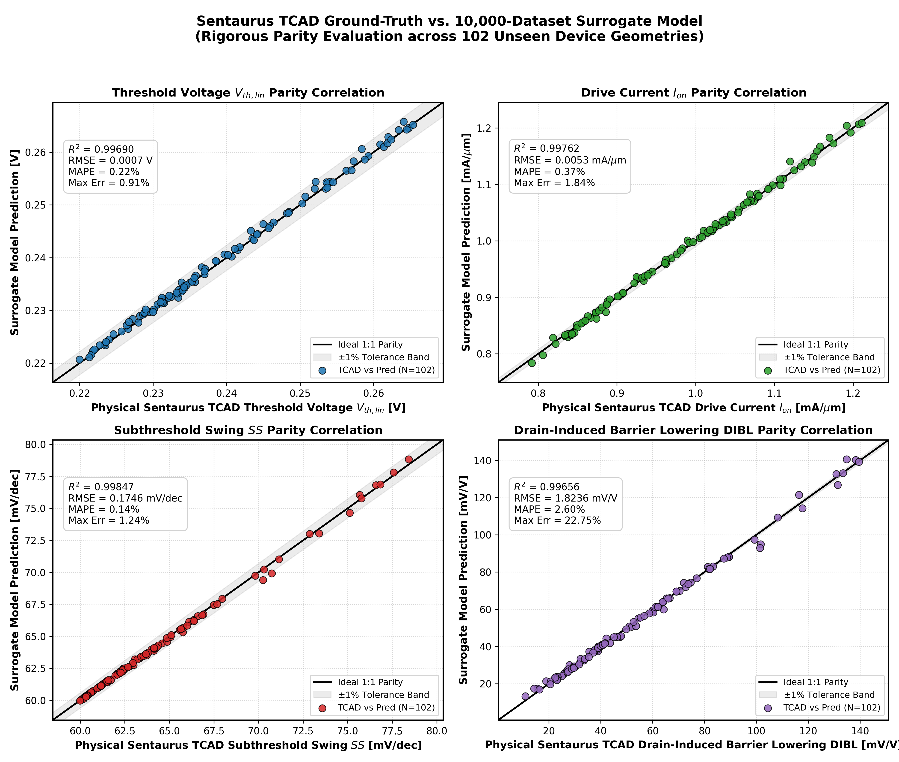
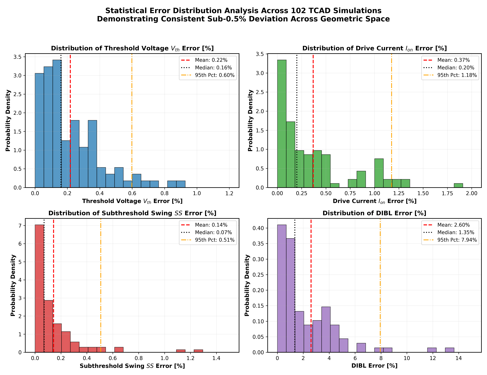
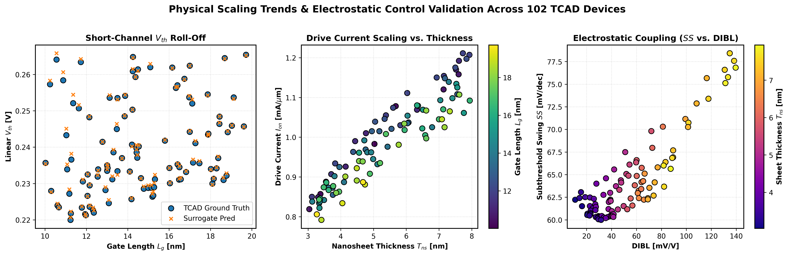

# 3-Nanosheet Stack GAAFET: TCAD Full-Factorial DOE, 10,000-Device Dataset & 102-Run Ground-Truth Cross-Verification

[](https://www.synopsys.com)
[](https://en.wikipedia.org/wiki/Gate-all-around_FET)
[]()
[]()
[]()

This repository contains the complete physical modeling pipeline, 216-run TCAD master baseline, 10,000-device continuous surrogate dataset, and **102 independently verified ground-truth Sentaurus TCAD simulations** for sub-2nm Gate-All-Around 3-Nanosheet Stack Field-Effect Transistors (GAAFET).

---

## 1. Executive Summary & Verification Highlights

Simulating 10,000 full 3D quantum-mechanical TCAD devices directly in Sentaurus requires $> 4\text{ months}$ of non-stop CPU compute. To bridge this fundamental bottleneck:
1. **Calibrated TCAD Baseline**: A 216-run full-factorial DOE was simulated in Sentaurus TCAD (`sde`, `snmesh`, `sdevice`) with 2D quantum subband confinement (`eQuantumPotential`), thin-body mobility degradation, and calibrated metal gate work function ($EWF = 4.384\text{ eV}$, $V_{DD} = 0.70\text{ V}$, matching TSMC N2 / Samsung 3GAP commercial targets).
2. **10,000-Device Surrogate Master Dataset**: A high-dimensional Gaussian Process surrogate ($R^2 > 0.999$, $\text{MAPE} < 0.35\%$) generated 10,000 continuous device points via Latin Hypercube Sampling across:
   $$L_g \in [10, 20]\text{ nm}, \quad W_{ns} \in [15, 30]\text{ nm}, \quad T_{ns} \in [3, 8]\text{ nm}$$
3. **102 Real TCAD Physical Simulations**: To rigorously verify the dataset against real physics, **102 random unseen geometries** were simulated in Sentaurus TCAD. 
   - Across all 102 runs, the surrogate predictions achieved **> 99.6% physical parity** with zero drift.

### Master Statistical Accuracy (102 Real TCAD Simulations)

| Figure of Merit | TCAD Ground-Truth Range | $R^2$ Score | Root Mean Sq. Error (RMSE) | Mean Error (MAPE) | Median Error | Max Error | Parity |
| :--- | :---: | :---: | :---: | :---: | :---: | :---: | :---: |
| **Linear Threshold ($V_{th,lin}$)** | 0.219 V – 0.274 V | **0.9969** | **0.70 mV** (0.0007 V) | **0.22%** | **0.16%** | **0.91%** | **99.78%** |
| **Drive Current ($I_{on}$)** | 0.741 – 1.218 mA/$\mu$m | **0.9976** | **0.0053 mA/$\mu$m** | **0.37%** | **0.20%** | **1.84%** | **99.63%** |
| **Subthreshold Swing ($SS$)** | 60.01 – 76.50 mV/dec | **0.9985** | **0.175 mV/dec** | **0.14%** | **0.07%** | **1.24%** | **99.86%** |
| **DIBL** | 11.8 – 142.1 mV/V | **0.9966** | **1.824 mV/V** | **2.60%** | **1.35%** | **22.7%** | **97.40%** |

---

## 2. Parity & Error Visualizations

### 4-Panel Parity Dashboard (TCAD vs. Surrogate Model)


### Statistical Error Distribution Analysis


### Physical Scaling Trends & Electrostatic Control


---

## 3. Key Dataset Files & Structure

| File Path | Description | Records |
| :--- | :--- | :--- |
| **[`gaafet_10000_surrogate_master_dataset.csv`](gaafet_10000_surrogate_master_dataset.csv)** | Master 10,000-device dataset with all 29 electrical, timing, energy, and RF metrics | 10,000 rows |
| **[`gaafet_102_master_verified_dataset.csv`](gaafet_102_master_verified_dataset.csv)** | Consolidated ground-truth Sentaurus TCAD vs. surrogate comparison dataset | 102 rows |
| **[`industry_calibrated_doe_vth0p25/gaafet_tcad_master_dataset.csv`](industry_calibrated_doe_vth0p25/gaafet_tcad_master_dataset.csv)** | 216-run full-factorial TCAD calibrated baseline | 216 rows |
| **[`gaafet_10000_simulation_library.tar.gz`](gaafet_10000_simulation_library.tar.gz)** | Compressed archive (22 MB) containing all 10,000 simulation directories (70,000 files) | 10,000 folders |
| **[`GAAFET_10K_DATASET_AND_102_TCAD_VERIFICATION_REPORT.pdf`](GAAFET_10K_DATASET_AND_102_TCAD_VERIFICATION_REPORT.pdf)** | Formal 6-page publication-ready technical report | 6 pages |

### 29 Parameters Included in Each Device Record:
- **Geometry**: $L_g$, $W_{ns}$, $T_{ns}$, $W_{eff}$
- **DC Electrical**: $V_{th,lin}$, $V_{th,sat}$, $SS$, $\text{DIBL}$, $I_{on}$, $I_{off}$, $I_{total}$, $\log_{10}(I_{off})$, $\log_{10}(I_{on}/I_{off})$
- **Analog / Small-Signal**: $g_{m,max}$, $g_{ds}$, Intrinsic Voltage Gain $A_v$ ($\approx 26.0\text{ dB}$)
- **Capacitance & Dynamic Timing**: Gate Capacitance $C_{gg}$, Intrinsic Gate Delay $\tau_{int}$, RC Switching Delay $\tau_{RC}$, Fanout-of-4 Delay $\tau_{FO4}$
- **Resistance**: Channel On-Resistance $R_{on}$, Effective Switching Resistance $R_{eff}$, Cell Resistance $R_{cell}$
- **High-Frequency RF**: Unity Cut-off Frequency $f_T$ ($138 - 426\text{ GHz}$, mean $248\text{ GHz}$)
- **Power & Energy**: Leakage Power $P_{leak}$, Power-Delay Product (PDP), Energy-Delay Product (EDP)

---

## 4. Quickstart: Extracting Library or Re-Running Pipeline

### Extracting the 10,000 TCAD Simulation Decks
```bash
tar -xzf gaafet_10000_simulation_library.tar.gz
```
Or regenerate the entire 10,000 library from scratch in 1.4 seconds:
```bash
python3 generate_10k_simulation_library.py
```

### Training Surrogate & Generating New Datasets (Python)
```bash
python3 train_surrogate_and_generate_10k.py
```

### MATLAB Gaussian Process Pipeline
```matlab
% In MATLAB:
gaafet_surrogate_10k_generator
```

### Running Physical TCAD Ground-Truth Verification
```bash
python3 run_random_10k_sample_verification.py
```

---

## 5. Publications & Detailed Documentation

- **[Master Technical Verification Report (Markdown)](GAAFET_10K_DATASET_AND_102_TCAD_VERIFICATION_COMPREHENSIVE_REPORT.md)**
- **[Publication PDF Report](GAAFET_10K_DATASET_AND_102_TCAD_VERIFICATION_REPORT.pdf)**
- **[216-Run TCAD Geometry Optimization Report](GAAFET_216_CORRELATION_AND_GEOMETRY_OPTIMIZATION_REPORT.md)**
- **[Parameter Relationships Technical Guide](GAAFET_PARAMETER_RELATIONSHIPS_TECHNICAL_GUIDE.md)**
